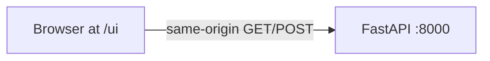

# API demo UI (one panel per endpoint)

## Scope (from [docs/TASK03_API_SECURITY_REPORT.md](docs/TASK03_API_SECURITY_REPORT.md))

| Endpoint | UI behavior |
|----------|-------------|
| `GET /health` | Button → show pretty-printed JSON (`status`, `model_loaded`) |
| `POST /auth/token` | Username/password → JSON body → show `access_token` (copy button); keep token in `sessionStorage` for the predict panels |
| `POST /predict/image` | Single file input (`file`) → `multipart/form-data` + `Authorization: Bearer …` → show `ImageResult` (detections table + raw JSON) |
| `POST /predict/batch` | Multi-select files (same field name `files` repeated) → batch result + raw JSON |
| `GET /metrics` | Button → show Prometheus text in a `<pre>` (read-only; aligns with report: metrics are plaintext, not JSON) |

Optional stretch (only if you want it in the same pass): draw bounding boxes on a canvas over the uploaded preview image using normalized pixel coords from `bbox` — not required to satisfy “UI for each API command.”

## Architecture

- **Why mount under FastAPI:** [api/Dockerfile](api/Dockerfile) build context is `./api`; keeping assets in `api/web/` avoids changing Compose build context. Pages loaded from `http://localhost:8000/ui/` can call `/health`, `/auth/token`, etc. with **relative URLs** (same origin), so [`.env.example`](.env.example) `CORS_ORIGINS` for `localhost:3000` stays relevant only if someone later runs a separate dev server on port 3000.

## Code changes

1. **New static site** — add [api/web/](api/web/) with:
   - `index.html`: layout with five sections (health, token, single predict, batch, metrics), shared header with link to `/docs` if desired.
   - `app.js`: small module or plain script that implements `fetch` calls matching the report’s `curl` semantics (JSON for auth; `FormData` for predict; no auth on health/metrics).
   - `styles.css`: simple readable layout (cards, monospace for responses, error states from non-2xx responses).

2. **Serve `/ui`** — in [api/app/main.py](api/app/main.py), after router includes, mount static files if the directory exists:

   - `from fastapi.staticfiles import StaticFiles`
   - `Path(__file__).resolve().parent.parent / "web"` → `StaticFiles(..., html=True)` at mount path `/ui` so `/ui/` serves `index.html`.

3. **Docker** — in [api/Dockerfile](api/Dockerfile), add `COPY web/ ./web/` (after `COPY app/` is fine) so the image includes the UI.

4. **Docs** — one short sentence in [README.md](README.md) (API section): open `http://localhost:8000/ui/` when the server is running (no new standalone markdown file unless you ask).

## Behavioral details to match the API

- **Predict uploads:** use `FormData.append("file", …)` for single; for batch, append each file with the key `files` (matches [api/app/routes/predict.py](api/app/routes/predict.py): `files: list[UploadFile] = File(...)`).
- **Auth header:** `Authorization: Bearer ${token}` from stored token; show a clear message if token is missing when calling predict.
- **Errors:** display `response.status` and parsed `detail` when present (FastAPI JSON errors).
- **Security UX:** do not echo password after submit; token in `sessionStorage` is acceptable for a local demo (report already notes production concerns for JWT storage).

## Verification

- Local: `cd api && uvicorn app.main:app --reload` → exercise each panel against a running API with a valid `MODEL_PATH`.
- Docker: `docker compose up --build` → `http://localhost:8000/ui/`.
- Existing tests unchanged; manual QA only unless you want a Playwright smoke test later.
