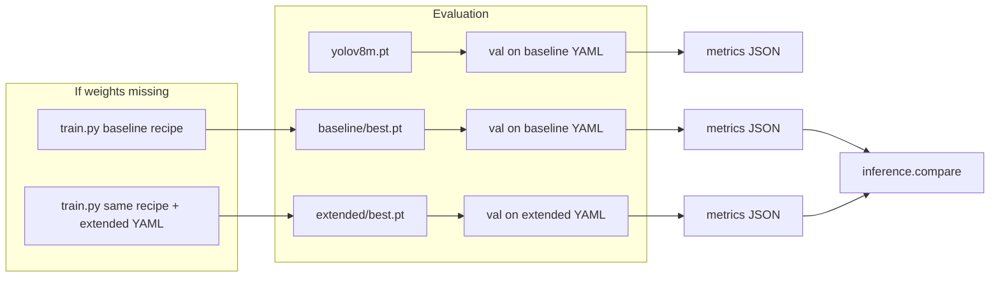

# Inference pipeline, training parity, and project report

## Context

- **Inference/eval** is implemented in [`inference/infer.py`](inference/infer.py): loads a `.pt`, runs `model.val()` on the dataset YAML (`--split val` by default), and writes JSON via [`inference/metrics.py`](inference/metrics.py) (overall + per-class mAP, P/R/F1, speed).
- **Datasets**: [`training/configs/sh17_baseline_resized.yaml`](training/configs/sh17_baseline_resized.yaml) (17 classes) and [`training/configs/sh17_extended_resized.yaml`](training/configs/sh17_extended_resized.yaml) (18 classes, adds `Face-shield`).
- **Weights**: [`models/baseline/args.yaml`](models/baseline/args.yaml) confirms a full 10-epoch baseline run under `project=models`, `name=baseline`. **`*.pt` is gitignored** ([`.gitignore`](.gitignore)), so `models/*/weights/best.pt` may exist only locally—verify before inferring.
- **Baseline training recipe** (authoritative) is logged in [`logs/training_terminal/baseline_train_10ep.log`](logs/training_terminal/baseline_train_10ep.log): `sh17_baseline_resized.yaml`, `yolov8m.pt`, epochs **10**, batch **32**, imgsz **640**, device **mps**, workers **4**, `lr0=0.01`, cosine LR, **cache false**, **AMP off**, **freeze 22**, **max_det 100**, **val_period 5**, fraction **1.0**, `project=models`, `name=baseline`, plus `training/tal_patch` applied when using [`training/train.py`](training/train.py) (do **not** substitute raw `yolo train` if you need the same TAL behavior).
- **Extended** in-repo [`models/extended/args.yaml`](models/extended/args.yaml) reflects a **1-epoch smoke** (fraction 0.05, freeze 10)—not a full extended pipeline. For “extended pipeline” metrics, plan to use **full-data** training with the **same hyperparameters as the baseline log** unless you later specify different epochs (e.g. 100) after you share the Word doc requirements.
- **Word doc**: not in the repo; you chose to **paste requirements or add the file later**—the report section will include a short checklist to merge API/ML-engineer deliverables from that doc once provided.



---

## 1) Run the inference pipeline (three models)

**Prerequisites**

- Virtualenv + `pip install -r requirements.txt`.
- Resized datasets on disk at the paths in the YAMLs (under `data/sh17_baseline_resized` and `data/merged_resized`). If missing, run [`training/prepare_data.py`](training/prepare_data.py) / [`training/resize_dataset.py`](training/resize_dataset.py) as already used for training.

**1-1 — Pretrained YOLO (no project fine-tuning)**

- Run `python -m inference.infer` with `--model yolov8m.pt` and `--data training/configs/sh17_baseline_resized.yaml`, e.g. `--output results/baseline/metrics_pretrained_yolov8m.json`, `--name baseline_pretrained_eval` (adjust `--project`/`--name` to keep Ultralytics run dirs tidy under `results/`).
- **Caveat**: COCO-pretrained `yolov8m.pt` is 80-class; Ultralytics may or may not accept `val()` cleanly against 17 PPE classes. If `val` errors or metrics are clearly invalid, document **qualitative** `predict` results only for this row (see section 3) and note the limitation in the report.

**1-2 — Baseline fine-tuned**

- Weights path: `models/baseline/weights/best.pt` (matches `save_dir` in the log).
- Run `infer` with that model and `sh17_baseline_resized.yaml`; save JSON e.g. `results/baseline/metrics_finetuned.json`.

**1-3 — Extended fine-tuned**

- Weights path: `models/extended/weights/best.pt` with `sh17_extended_resized.yaml`; save JSON e.g. `results/extended/metrics_finetuned.json`.

**Consistency**: Use the same `--imgsz 640`, `--conf 0.25`, `--iou 0.7`, `--device`, and `--batch` across all three unless you are explicitly studying sensitivity (defaults already match training imgsz/conf/iou in [`inference/infer.py`](inference/infer.py)).

---

## 2) If weights are missing — train with the baseline log arguments

**Baseline** (must match log exactly):

```bash
python training/train.py \
  --config training/configs/sh17_baseline_resized.yaml \
  --model yolov8m.pt \
  --epochs 10 \
  --batch 32 \
  --imgsz 640 \
  --device mps \
  --workers 4 \
  --lr0 0.01 \
  --cos-lr \
  --cache false \
  --fraction 1.0 \
  --no-amp \
  --max-det 100 \
  --val-period 5 \
  --freeze 22 \
  --name baseline
```

(`--project` defaults to `models` in [`training/train.py`](training/train.py)—same as the log.)

**Extended** (same hyperparameter stack, swap config and run name):

```bash
python training/train.py \
  --config training/configs/sh17_extended_resized.yaml \
  --model yolov8m.pt \
  --epochs 10 \
  --batch 32 \
  --imgsz 640 \
  --device mps \
  --workers 4 \
  --lr0 0.01 \
  --cos-lr \
  --cache false \
  --fraction 1.0 \
  --no-amp \
  --max-det 100 \
  --val-period 5 \
  --freeze 22 \
  --name extended
```

- **Note**: This replaces the old **smoke** extended settings (1 epoch, `fraction 0.05`, `freeze 10` in [`models/extended/args.yaml`](models/extended/args.yaml)). If the Word doc demands longer extended training, rerun with a higher `--epochs` after you share that spec.

---

## 3) Random / sample images for detection

[`inference/infer.py`](inference/infer.py) is **validation/metrics**, not saved prediction plots. For report figures:

- Pick **N** random images from each val set (or a fixed seed for reproducibility).
- For each checkpoint (`yolov8m.pt`, baseline `best.pt`, extended `best.pt`), run Ultralytics **`predict`** with `save=True` and a dedicated `project/name` under e.g. `results/baseline/samples/`, `results/extended/samples/` (keep extended model on extended images for class consistency).
- Optional: small helper script or documented one-liner in Python using `YOLO(...).predict(...)` so the report can cite exact paths.

---

## 4) Comparison and rubric

- After baseline and extended JSONs exist, run [`inference/compare.py`](inference/compare.py) (face-shield target and regression threshold as needed) and save e.g. `results/comparison/rubric.json`.
- Interpret output in the report: face-shield mAP@0.5 vs target, per-class regressions.

---

## 5) Detailed project report (deliverable)

Produce **one** narrative document (recommended: extend or replace TODOs in [`docs/REPORT.md`](docs/REPORT.md), or add a dedicated `docs/INFERENCE_EVALUATION.md` if you prefer separation—your choice when implementing).

Suggested sections:

1. **Setup** — Python/torch/ultralytics versions, device, data paths.
2. **Pipelines** — data merge/resizing (pointer to [`docs/DECISIONS.md`](docs/DECISIONS.md) / [`project_reports/`](project_reports/) if used), training commands (exact baseline log + extended mirror), TAL patch note.
3. **Quantitative results** — table for pretrained vs baseline vs extended: mAP@0.5, mAP@0.5:0.95, precision, recall, F1, inference speed from JSON; short per-class highlights.
4. **Rubric** — summary of `inference.compare` outcome.
5. **Qualitative** — a few saved prediction images per model (with paths/filenames).
6. **Inference API** — summarize endpoints/auth from [`README.md`](README.md) / `api/`; **merge any extra requirements from the Word doc** once you paste or add the file.
7. **Reproducibility** — exact commands and output file paths.

---

## 6) Save this plan under `.cursor`

After you approve the plan, write it to **`.cursor/plans/`** (e.g. `inference_and_project_report.plan.md`) so it lives alongside your other Cursor plans.
