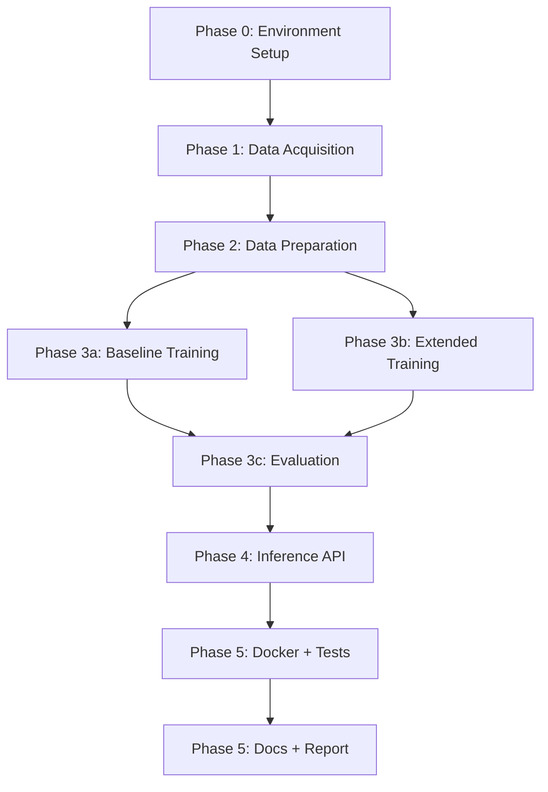

# PPE Detection API -- Adapted Plan

## Key Differences from Friend's Plan

The friend's plan marks all tasks as "completed" and assumes a ready environment. Here is what actually differs:


| Area | Friend's Plan | Your Environment |
| ---- | ------------- | ---------------- |


- **Python**: Assumes packages installed -- You have only system Python 3.9.6 (too old for ultralytics). Need pyenv + Python 3.11.
- **APD dataset**: Assumes `apd.v22i.yolov8/` is in project dir -- It is at `~/Downloads/apd.v22i.yolov8/`.
- **Kaggle credentials**: Assumes `~/.kaggle/kaggle.json` -- Missing. You have `Kaggle_API_key` in `.env` but no `kaggle.json`. We have Kaggle MCP tools available in Cursor.
- **Training device**: Plan says `device="cpu"` -- You can use `device="mps"` (Apple M4 GPU).
- **Polygon labels**: Plan says ~7% polygons -- Actual: 746/6023 = ~12.4%. Same conversion logic applies.
- **All todos**: Marked "completed" -- All should be "pending" (nothing built yet).
- **Project dir**: Only contains `.env`, `.git`, docx, and the plan file. No code, no directories.

---

## Phase 0 -- Environment Setup (NEW -- not in friend's plan)

This phase must happen first before any coding.

### 0a. Install Python 3.11 via pyenv

```bash
brew install pyenv
pyenv install 3.11.9
pyenv local 3.11.9    # sets .python-version in project root
```

### 0b. Create virtual environment and install dependencies

```bash
python -m venv .venv
source .venv/bin/activate
pip install --upgrade pip
```

We will need two `requirements.txt` files (same as the friend's plan structure):

- Root `requirements.txt` for training: `ultralytics`, `opencv-python-headless`, `Pillow`, `pyyaml`, `matplotlib`
- `api/requirements.txt` for the API: `fastapi`, `uvicorn[standard]`, `python-jose[cryptography]`, `passlib[bcrypt]`, `python-multipart`, `prometheus-fastapi-instrumentator`, `slowapi`, `ultralytics`, `Pillow`

### 0c. Copy APD dataset into project

```bash
mkdir -p data
cp -r ~/Downloads/apd.v22i.yolov8 data/apd.v22i.yolov8
```

Copying (not symlinking) so the project is self-contained and Docker builds work cleanly.

### 0d. Create .gitignore, .env.example, project scaffold

The friend's plan has the right directory structure -- we just need to actually create it:

```
PPE_Detection/
├── data/                       # gitignored
│   ├── sh17/
│   ├── apd.v22i.yolov8/       # copied from ~/Downloads
│   └── merged/
├── logs/
├── training/
│   ├── configs/
│   ├── prepare_data.py
│   ├── train.py
│   ├── evaluate.py
│   └── log_utils.py
├── api/
│   ├── app/
│   │   ├── main.py
│   │   ├── config.py
│   │   ├── auth.py
│   │   ├── detector.py
│   │   ├── schemas.py
│   │   └── routes/
│   ├── Dockerfile
│   ├── requirements.txt
│   └── tests/
├── docs/
├── docker-compose.yml
├── requirements.txt
├── .env.example
├── .gitignore
├── .python-version
└── README.md
```

---

## Phase 1 -- Data Acquisition

### SH17 Dataset

Download via Kaggle MCP tools available in Cursor (`user-kaggle-download_dataset` with `ownerSlug: "mugheesahmad"`, `datasetSlug: "sh17-dataset-for-ppe-detection"`). This avoids needing `~/.kaggle/kaggle.json`.

For local development: download only labels + split files first, then a subset of images. Full dataset is ~14 GB.

**Important**: The `.env` file currently has `Kaggle_API_key=KGAT_...` which is a Kaggle API token but is NOT in the standard `kaggle.json` format. The MCP tools handle auth separately, so this token may not be needed for the download step. We should verify MCP auth first and fall back to setting up `~/.kaggle/kaggle.json` if needed.

### APD Dataset

Already available. Copy from `~/Downloads/apd.v22i.yolov8/` to `data/apd.v22i.yolov8/` as described in Phase 0c. Verified structure: 4854 train / 331 valid / 139 test images with matching labels.

---

## Phase 2 -- Data Preparation

Friend's plan for `training/prepare_data.py` is solid. Key corrections for your data:

- **Polygon annotations**: 746 out of 6023 total annotation lines (12.4%, not ~7% as stated). Same min/max conversion approach works.
- **Class mapping** (unchanged from friend's plan):
  - APD `face shield` (1) --> merged class 17
  - APD `person` (8) --> merged class 0
  - APD `mask` (3) --> merged class 4
  - APD `earmuff` (0) --> merged class 7
  - APD `gloves` (2) --> merged class 9
  - APD classes 4-7 (`no` *) --> discarded

Output: `data/merged/` with `images/train/`, `images/val/`, `labels/train/`, `labels/val/`, `data.yaml`, `merge_report.json`.

---

## Phase 3 -- Fine-Tuning Pipeline

### Changes from friend's plan for Apple M4 MPS training

The friend's plan uses `device="cpu"`. Key modifications:

```python
model.train(
    data="configs/sh17_extended.yaml",
    epochs=100,
    imgsz=640,
    batch=8,           # 8, not 16 -- 16GB RAM is tight with YOLOv8m on MPS
    device="mps",      # Apple Silicon GPU, not "cpu"
    project="runs",
    name="extended",
    workers=4,          # limit for macOS
)
```

**MPS-specific considerations**:

- Start with `batch=8`. If memory allows, try `batch=12`. YOLOv8m + 640px + batch=16 may OOM on 16GB.
- MPS is ~3-5x faster than CPU for YOLOv8 on M4 but slower than a dedicated NVIDIA GPU.
- Training 100 epochs on merged data (~9k images) will take several hours on MPS. Expect ~2-3 min/epoch.
- Some ultralytics operations may fall back to CPU on MPS -- this is normal.

### Local quick-test (same as friend's plan)

Use `--sample` flag with prepare_data.py (50 SH17 + 20 APD images), train 2-3 epochs to verify pipeline.

---

## Phase 4 -- Inference API

Friend's plan is accurate. No environment-specific changes needed -- the API code is standard Python/FastAPI.

One note: the Docker image (`python:3.11-slim`) works on ARM64 (Docker Desktop handles multi-arch). For the `COPY model/` step, you will need trained weights from Phase 3 available at build time.

---

## Phase 5 -- Docker, Tests, Docs

### Docker

Friend's Dockerfile and docker-compose.yml approach is fine. On macOS ARM64, `docker build` will create an arm64 image by default. If you need amd64 (for cloud deployment), add `--platform linux/amd64`.

### Tests and Documentation

No changes needed from the friend's plan.

---

## Implementation Order




Each phase produces testable output before moving on. Phase 0 is the critical new addition that the friend's plan omitted entirely.