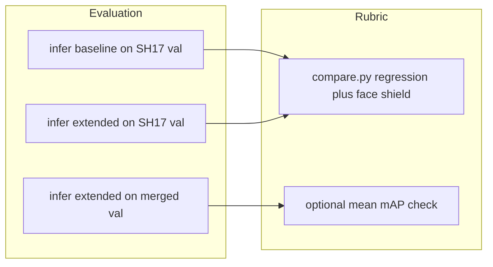

# Plan: mAP@0.5 ≥ 0.65 and full rubric pass

## Baseline facts (from this chat)

- Extended fine-tuned **overall mAP@0.5 ≈ 0.501** on merged val ([`results/extended/metrics_finetuned.json`](results/extended/metrics_finetuned.json)).
- [`results/comparison/rubric.json`](results/comparison/rubric.json): **failing** classes vs baseline — **Person** (−3.3 pp), **Face** (−8.5 pp), **Foot** (−6.9 pp), **Medical-suit** (−6.3 pp); **Face-shield** 0.36 vs target **0.65**.
- Rubric logic: shared classes **PASS** if `extended_ap50 - baseline_ap50 ≥ -0.03` (3 **percentage points**); **Face-shield** **PASS** if `ap50 ≥ 0.65` ([`inference/compare.py`](inference/compare.py)).
- Training today: Ultralytics via [`training/train.py`](training/train.py) with `freeze` (e.g. `22` = almost only head trains). Merged data is **not** class-balanced; APD adds mainly Person / mask / gloves / earmuffs / face-shield, **not** Face / Foot / Medical-suit counts.

Closing the **0.50 → 0.65** mean mAP gap is much larger than fixing the four regressions alone: tail classes (e.g. Ear, Tools, Face) sit far below 0.65, so the plan must lift **all** classes, not only the rubric failures.

---

## Phase 1 — Make evaluation trustworthy

1. **Fixed protocol for regression**  
   Regenerate comparison JSONs with [`inference/infer.py`](inference/infer.py) using **consistent** `imgsz`, `conf`, `iou`, `device`, then [`inference/compare.py`](inference/compare.py). Optionally add a second report: **both** checkpoints evaluated on **SH17-only val** (same images) for the 17 shared classes, to separate **forgetting** from **merged-val distribution shift**.

2. **Track mean mAP@0.5 explicitly**  
   Your second goal is **not** in [`inference/compare.py`](inference/compare.py) today (it only checks regressions + Face-shield). Either document “overall average” as `metrics_finetuned.json` → `overall.mAP50`, or extend compare output with `mean_ap50` and a `mean_ap50_target: 0.65` so CI/reporting matches intent.

---

## Phase 2 — Data and sampling (highest leverage for mean mAP + rubric)

1. **Face-shield toward 0.65**  
   Increase **quantity and quality** of face-shield boxes (more APD or additional datasets, audit borderline labels). This class is the rubric’s **absolute** gate and is currently the largest single shortfall.

2. **Mitigate forgetting (Person, Face, Foot, Medical-suit)**  
   - **Replay / balance:** each epoch, mix a fixed fraction of **SH17-only** batches (or oversample images containing underperforming classes) so extended training does not drift toward APD statistics alone.  
   - **Rare-class emphasis:** oversample images that contain Face, Medical-suit, Foot (low instance counts on SH17; merge does not add new boxes for Face/Foot/Medical-suit).

3. **Tail classes for mean mAP 0.65**  
   Mean mAP cannot reach 0.65 unless weak classes (e.g. Ear, Tools, Hands, Face-guard) improve substantially — likely needs **more labeled examples**, **hard-negative** curation, or **synthetic/copy-paste** aug for small objects, not only hyperparameter tweaks.

Implementation options (pick one path when executing):  
- **Offline:** build a weighted image list or duplicate/symlink rare-class images into train (simplest, no Ultralytics fork).  
- **Online:** custom dataloader / Ultralytics callback (more work, more control).

---

## Phase 3 — Model and training recipe

1. **Staged optimization (replace head-only as the only stage)**  
   - **Stage A:** From `yolov8m.pt` or from [`models/baseline/weights/best.pt`](models/baseline/weights/best.pt), train 18-class head with `freeze` high enough to stabilize (similar to current).  
   - **Stage B:** **Unfreeze** backbone (lower `freeze`, e.g. 10 → 0) with **smaller `lr0`** and **more epochs** so Person / Face / Foot recover and tail classes gain capacity.  
   - **Stage C (optional):** short fine-tune on **SH17-only** with frozen or low-LR backbone to polish the 17 classes before final merged polish (helps regression rubric).

2. **Capacity**  
   If memory allows: **YOLOv8l** or **`imgsz` 640 → 768/960** for small PPE classes; re-tune batch size.

3. **Regularization**  
   Sensible mosaic/mixup (your current [`training/train.py`](training/train.py) sets `mosaic=0.0`; consider mild mosaic for generalization if it does not hurt small objects). Use **early stopping** on **merged val mAP@0.5** and optionally on **SH17 val** for the 17-class subset.

4. **Hyperparameter search (narrow)**  
   Grid small: `lr0`, `lrf`, epochs per stage, `freeze` schedule. Track **mean mAP@0.5** and **per-class** AP on merged val plus SH17 val.

---

## Phase 4 — Verification gate

1. Run `infer` → `compare` → confirm: **no** `regression_failures`, **Face-shield** ≥ 0.65, **`overall.mAP50` ≥ 0.65** on the agreed split (recommend reporting **merged val** as primary for the extended model, **SH17 val** as anti-forgetting check).

2. If rubric passes but mean mAP &lt; 0.65: prioritize **tail-class data** and **full-network epochs**, not more head-only training.

---

## Risk and scope note

Hitting **0.65 mean mAP@0.5** on 18 diverse PPE classes may be **infeasible** without substantial new labels or a larger model; treat **0.65** as a target to iterate toward with the metrics above, not a guarantee from recipe changes alone.
