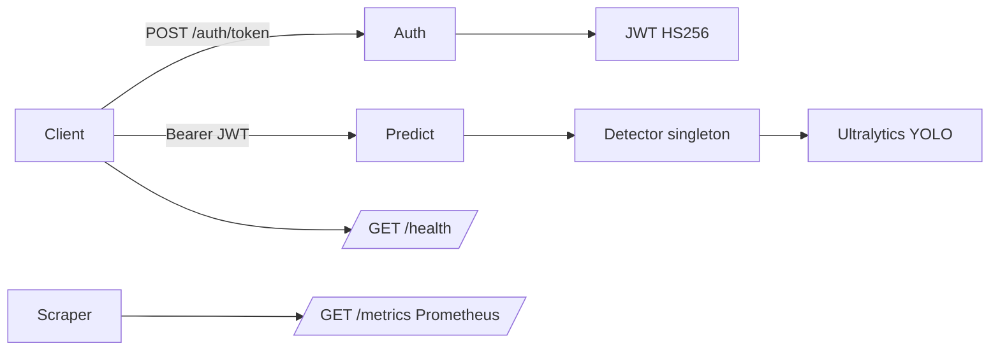

# Task 03 — Inference API, Docker, and security report

## Current state (already in repo)

Most of the assignment is **already implemented**:

| Requirement | Location |
|-------------|----------|
| `POST /predict/image` | [`api/app/routes/predict.py`](api/app/routes/predict.py) |
| `POST /predict/batch` | same |
| `GET /health` | [`api/app/routes/health.py`](api/app/routes/health.py) |
| `GET /metrics` | [`api/app/main.py`](api/app/main.py) via `prometheus-fastapi-instrumentator` on `/metrics` (HTTP request/latency histograms) |
| `POST /auth/token` | [`api/app/routes/auth.py`](api/app/routes/auth.py) |
| YOLO singleton + inference | [`api/app/detector.py`](api/app/detector.py) |
| Dockerfile | [`api/Dockerfile`](api/Dockerfile) (Python 3.11-slim, OpenCV deps, uvicorn) |
| Local orchestration | [`docker-compose.yml`](docker-compose.yml) |
| Config / secrets via env | [`api/app/config.py`](api/app/config.py), [`.env.example`](.env.example) |
| Tests | [`api/tests/test_api.py`](api/tests/test_api.py) |

**Existing hardening (good to cite in the report):** JWT (`python-jose`) + bcrypt for credentials, `UploadFile` validation (MIME allowlist, max size, `PIL` verify), global exception handler avoiding stack traces in responses, CORS from env, optional rate-limit settings (see gap below).

## Gaps to address during implementation

1. **Rate limiting may not be enforced**  
   [`api/app/main.py`](api/app/main.py) creates a `slowapi` `Limiter` and registers the exception handler, but **no route uses `@limiter.limit(...)`** and predict handlers do not take `request: Request` for slowapi. Without decorators/middleware wiring, `RATE_LIMIT` in [`.env.example`](.env.example) may have no effect.  
   **Action:** Apply slowapi’s documented pattern: inject `request: Request` into protected routes and decorate `/predict/*` (and optionally `/auth/token`) with `@limiter.limit(settings.rate_limit)` or explicit limits. Re-run [`api/tests/test_api.py`](api/tests/test_api.py).

2. **Docker model path vs your tree**  
   [`docker-compose.yml`](docker-compose.yml) mounts `./runs` → `/app/model` and sets `MODEL_PATH=model/extended/weights/best.pt`. Your recent artifacts live under [`models/baseline_20ep/`](models/baseline_20ep/) and [`models/extended_20ep/`](models/extended_20ep/) (not necessarily `./runs`).  
   **Action:** Update compose (and/or README) so a **clone-fresh** `docker compose up` works: e.g. mount `./models:/app/model:ro` and set `MODEL_PATH` to a real default such as `model/extended_20ep/weights/best.pt`, or document a one-line copy into `runs/...`—pick one consistent story and match [`.env.example`](.env.example) comments.

3. **Batch abuse**  
   `/predict/batch` accepts an unbounded file list (memory/CPU DoS).  
   **Action:** Add a configurable `max_batch_images` (e.g. 10–32) in [`api/app/config.py`](api/app/config.py), enforce in [`predict.py`](api/app/routes/predict.py), document in the report.

4. **Optional Dockerfile hardening (lightweight)**  
   Non-root user, `PYTHONDONTWRITEBYTECODE=1`, pin base image digest if you want stronger supply-chain story for the presentation (optional; keep changes minimal).

## Deliverable: “complete report”

Add a single markdown document the grader can read standalone, for example **[`docs/TASK03_API_SECURITY_REPORT.md`](docs/TASK03_API_SECURITY_REPORT.md)** (you explicitly asked for a report; this does not replace [`docs/REPORT.md`](docs/REPORT.md) unless you want a short pointer there later).

**Suggested sections:**

1. **Summary** — What the service does (PPE YOLO inference).
2. **Design** — Stack (FastAPI, Ultralytics), auth flow (username/password → JWT → Bearer on predict), response JSON shapes from [`schemas.py`](api/app/schemas.py).
3. **How to run** — `uvicorn` from `api/`; `docker compose up --build`; required env vars from [`.env.example`](.env.example); example `curl` for token + single image + batch.
4. **Security review (for presentation)** — Table format: **Vulnerability / Risk / Mitigation (current or planned)**. Topics to cover explicitly:
   - Weak or leaked `JWT_SECRET_KEY` / default credentials
   - JWT theft, expiry, no refresh/revocation (document tradeoff for local demo)
   - Unauthenticated `/metrics` and `/health` (operational need vs information disclosure; mitigations: network policy, scrape auth, separate internal port)
   - Upload attacks: oversized payloads, decompression bombs, malicious images (what PIL verify does/does not do)
   - Batch and inference **resource exhaustion** (mitigation: max batch, rate limits, timeouts, queue in production)
   - CORS misconfiguration
   - Dependency and container image risk (scanning, pinning)
   - Logging: avoid logging tokens or raw image content
5. **Azure / cloud** — High-level checklist: **Azure Container Apps or AKS** + **Azure Container Registry**; **Key Vault** for secrets; **Managed Identity** instead of long-lived keys where possible; **Application Gateway / Front Door + WAF**; **Private Endpoint** for API if internal; **Azure Monitor / Prometheus** for metrics; **Defender for Cloud**; encryption in transit (TLS termination at edge); **DDoS Protection**; **least-privilege** managed identity to storage if models are in blob; **content safety** if user uploads PII scenes.

## Verification

- Run `pytest api/tests/test_api.py` from repo root or `api/` (adjust `PYTHONPATH` if needed).
- Smoke-test container: health, token, one prediction with a small JPEG.

No Kaggle or external MCP required for this task.
