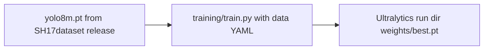

# YOLOv8m (SH17-pretrained) weights + same fine-tuning pipeline

## Source of truth for weights

The [SH17dataset GitHub release v1](https://github.com/ahmadmughees/SH17dataset/releases/tag/v1) publishes **YOLOv8 family checkpoints trained on SH17**. For medium size, the asset is:

- **File:** `yolo8m.pt`  
- **URL:** `https://github.com/ahmadmughees/SH17dataset/releases/download/v1/yolo8m.pt`

Naming note: this is **`yolo8m.pt`** (authors’ spelling), not Ultralytics’ auto-download name `yolov8m.pt` (COCO, 80 classes). Your project already documents COCO pretrain in [README.md](README.md) and [docs/REPORT.md](docs/REPORT.md); switching `--model` to the SH17 checkpoint is the only training change.



## Where to put the file

[`models/*/` and `*.pt` are gitignored](.gitignore), which is appropriate for large binaries. Save the release asset **as `yolo8m.pt`** (same name as upstream; do not rename it). Example location: `models/pretrained/yolo8m.pt`.

Download example (run from repo root):

```bash
mkdir -p models/pretrained
curl -fL -o models/pretrained/yolo8m.pt \
  https://github.com/ahmadmughees/SH17dataset/releases/download/v1/yolo8m.pt
```

## Fine-tuning: use existing pipeline as-is

Training is already centralized in [training/train.py](training/train.py): it loads `YOLO(args.model)`, applies [training/tal_patch.py](training/tal_patch.py), and calls `model.train(data=..., ...)`. No code changes are required if the checkpoint loads under your current `ultralytics` version.

**Baseline (17 classes)** — keep every flag identical to your current recipe; **only** replace the pretrained init from COCO (`yolov8m.pt`) with the downloaded SH17 checkpoint:

```bash
python training/train.py \
  --config training/configs/sh17_baseline_resized.yaml \
  --model models/pretrained/yolo8m.pt \
  ... # everything else unchanged from your normal baseline run
```

**Extended (18 classes, adds Face-shield)** — same as above with [training/configs/sh17_extended_resized.yaml](training/configs/sh17_extended_resized.yaml); only `--model` points at `models/pretrained/yolo8m.pt`. Ultralytics will adapt the detection head from 17 to 18 classes when `nc` in the data YAML is 18.

```bash
python training/train.py \
  --config training/configs/sh17_extended_resized.yaml \
  --model models/pretrained/yolo8m.pt \
  ... # everything else unchanged from your normal extended run
```

No repo files, run names, or output layout need to change beyond which `--model` file you pass (unless you intentionally use a different `--name`/`--project` to keep separate Ultralytics folders).

## Sanity checks (recommended before long runs)

1. **Loads cleanly:** `python -c "from ultralytics import YOLO; YOLO('models/pretrained/yolo8m.pt')"` — watch for version/architecture warnings; [requirements.txt](requirements.txt) pins only `ultralytics` with no floor, so if load fails, align with the release note (~8.0.x) or upgrade until compatible.
2. **Class count:** Confirm the checkpoint reports **17** classes and that [training/configs/sh17_baseline_resized.yaml](training/configs/sh17_baseline_resized.yaml) class **order/names** match SH17’s definition (your YAML already mirrors the project’s SH17 merge conventions; if anything drifts, validation metrics will look wrong even when training runs).
3. **Optional HP note:** The current recipe uses heavy freezing (`--freeze 22`), which was tuned for **COCO → PPE**. Starting from **SH17-pretrained** weights, you may get better gains with a lower freeze or shorter “head-only” phase; that is an experiment on top of “same pipeline,” not a requirement.

## Evaluation and API (unchanged)

- Run [inference/infer.py](inference/infer.py) with `--model` pointing at the new run’s `weights/best.pt` and the matching `--data` YAML, as you do today.
- Point [api](api/app/config.py) / `MODEL_PATH` at the chosen `best.pt` when serving.

## Optional docs (only if you want the repo to record this)

You asked for behavior, not documentation. If you want traceability later, a single sentence in [README.md](README.md) under Training linking the release URL and `--model models/pretrained/yolo8m.pt` is enough; otherwise the download command above can live in your own notes.
